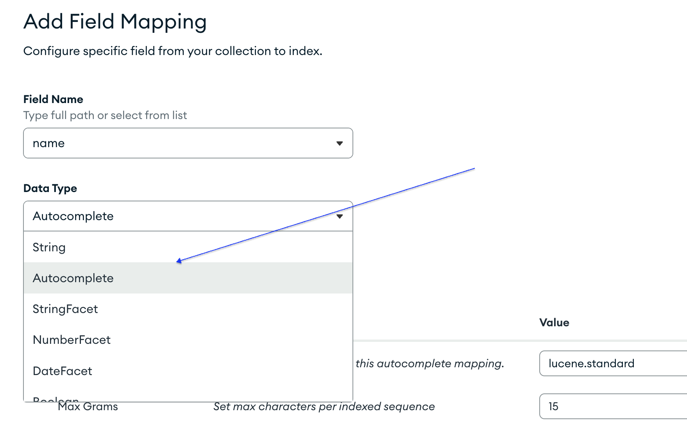

# AUTOCOMPLETE

## Create Search Index

In MongoDB, go to the desired collection.
Inside collection, go to Search Indexes -> Create Search Indexes.
We choose Visual Editor

Index Name : we leave "default". It can be changed though.
We make sure the collection selected is the one we want -> Next
Now we click in "Refine Your INdex" to be able to edit the default config.

What is an Index? is just simple data added to every document, and we won't be able ti see or send with the document.
If we leave "Dynamic Mapping" on, all fields will be indexed, and we don't want that for this example. It will also make the search slowerd.

We click in "Add Field Mapping"
We give it a name, and better be the name of the field we are gonna use for the search.
In "Data Type" we select "Autocomplete". We click on "Add" and then "Save Changes", and finally "Create Search INdex"

hummus comprado, con comino en polvo molido
encima algo de yogur griego con ralladura de lima
choro de aceite
ravanitos cortados , piparras y algo de miel

patatas revolconas con patatas cocidas y sobrasada. acabadas con torreznos y  chorrito de lima

1. Select _Search Indexes_ .
2. Click in _Create Search Index_ .
3. Select _Visual Editor_ and click in _Next_ .
4. Choose a name for the index and leave it as _default_ . Choose the collection (and Database if more than one). Then click in _Next_. .
5. Click in _Refine Your Index_. .
6. Disable _Dynamic Mapping_ . This option will try to index according to our searches and data types, but will make it slower. .
7. Click in _Add Field Mapping_. .
8. Select the name of the field you will use for the search. .
9. In _Data Type_ select _Autocompleate_. .
10. Then  click in _Add_ and _save_changes, and finally in _Create Index_.   . 
11. Now we wait until MongoDB processes our request and creates the index.

## aggreagate Array properties

- __fuzzy__ : Fuzzy matching is a search technique that allows for some degree of error or "fuzziness" in the search results.

- __maxEdits__: specifies the maximum number of edits allowed in the search query to consider a match. An "edit" in this context can be a character insertion, deletion, or substitution.
For example, if maxEdits is set to 1, the search would allow for up to one character difference between the search query and the document field being searched.

 For example, search for "Los Angelez" :

- __`maxEdits: 1`__, the fuzzy search will consider variations like "Los Angeles" because it allows for one edit (changing "z" to "s") to match the user's input.
  
- __`maxEdits: 2`__, would consider variations like:
  - "Los Angeles" (changing "z" to "s").
  - "Los Angelos" (changing "z" to "o" and "e" to "o").
  - "Los Angles" (changing "z" to "s" and "z" to "e").
  - "Los Anglesz" (changing "z" to "s" and adding "z" at the end).
  
- __$limit__ : fix the number of documents returned from our DB matching the search. We usually do not want to have a too big of a number of suggestion for autocompletion.
- __$project__: To define the shape of the document we get from our database. We can specfify which properties we want those documents to include. If to create the suggestions in our client, we only need, e.g.,  the name and the image, we do not need to receive all the properties of the document.
`_id` is included by default, therefore is the only field which we need to explicitly exclude in the projection. For all other fields _we just need to state the inclusion_, in other words, if we don't want a property to be included, we just have to leave it out of that object.

```javascript
//this will exclude _id, and inclide image, name and countryCode
$project: {
            _id: 0,
            image: 1,
            name: 1,
            countryCode: 1,
          }
//This will exclude _id and countryCode
$project: {
            _id: 0,
            image: 1,
            name: 1,
          },
```

To use the array with the stages or phases for our aggregage function, we just need to pass it to the method:

```javascript
try {
const citiesByName = await cityModel.aggregate(agg);
// send the result to the client in the response
res.status(200).json({citiesByName})
}catch {
//handle error
}
```
